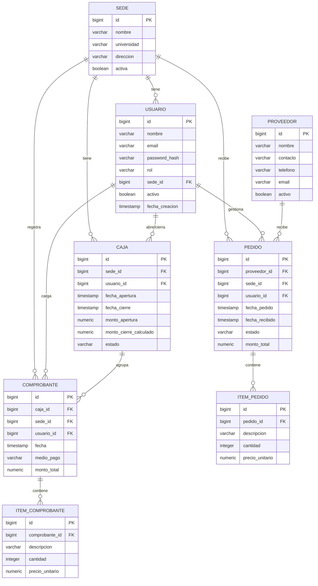

# Diseño de Base de Datos y Módulos

**Integrantes:** Nazareno Aranda, Julian Blanco Cortes
**Proyecto:** Sistema de gestión de caja y proveedores — cadena de comedores universitarios

---

## 1. Esquema de Base de Datos (relacional — PostgreSQL)

El script completo para crear las tablas está en [`../database/schema.sql`](../database/schema.sql).

### 1.1 Diagrama Entidad-Relación

### 1.2 Descripción de entidades

| Entidad | Descripción |
|---|---|
| **Sede** | Cada comedor de la cadena. Punto central que agrupa usuarios, cajas, comprobantes y pedidos. |
| **Usuario** | Personas que usan el sistema. Rol: `admin` (visión global, sin sede fija), `cajero` (atado a una sede), `compras` (gestiona pedidos, puede estar atado a una sede o ser central). |
| **Caja** | Apertura/cierre de caja de una sede en un turno o día. Agrupa los comprobantes emitidos en ese período. |
| **Comprobante** | Una venta registrada, asociada a una caja, sede y usuario (cajero). |
| **Item_Comprobante** | Detalle de productos vendidos dentro de un comprobante, para cuando se quiera desglosar la venta y no solo guardar el monto total. |
| **Proveedor** | Proveedores externos de insumos/alimentos. |
| **Pedido** | Un pedido realizado a un proveedor desde una sede. |
| **Item_Pedido** | Detalle de los productos/insumos incluidos en un pedido. |

### 1.3 Diccionario de datos

**Convenciones:** `PK` clave primaria, `FK` clave foránea, `NN` NOT NULL, `UQ` UNIQUE. Los importes usan `NUMERIC(12,2)` para evitar errores de redondeo. Los valores permitidos de `rol`, `estado` y `medio_pago` se controlan con `CHECK`.

**sede**

| Campo | Tipo | Restricciones |
|---|---|---|
| id | BIGSERIAL | PK |
| nombre | VARCHAR(150) | NN |
| universidad | VARCHAR(150) | — |
| direccion | VARCHAR(200) | — |
| activa | BOOLEAN | NN, default TRUE |

**usuario**

| Campo | Tipo | Restricciones |
|---|---|---|
| id | BIGSERIAL | PK |
| nombre | VARCHAR(150) | NN |
| email | VARCHAR(150) | NN, UQ |
| password_hash | VARCHAR(255) | NN |
| rol | VARCHAR(20) | NN, CHECK: `admin`, `cajero`, `compras` |
| sede_id | BIGINT | FK → sede(id), opcional (el admin puede no tener sede fija) |
| activo | BOOLEAN | NN, default TRUE |
| fecha_creacion | TIMESTAMP | NN, default now() |

**caja**

| Campo | Tipo | Restricciones |
|---|---|---|
| id | BIGSERIAL | PK |
| sede_id | BIGINT | NN, FK → sede(id) |
| usuario_id | BIGINT | NN, FK → usuario(id) (cajero responsable) |
| fecha_apertura | TIMESTAMP | NN, default now() |
| fecha_cierre | TIMESTAMP | — (queda vacío mientras la caja está abierta) |
| monto_apertura | NUMERIC(12,2) | NN, default 0 |
| monto_cierre_calculado | NUMERIC(12,2) | — (se calcula al cerrar) |
| estado | VARCHAR(20) | NN, default `abierta`, CHECK: `abierta`, `cerrada` |

**comprobante**

| Campo | Tipo | Restricciones |
|---|---|---|
| id | BIGSERIAL | PK |
| caja_id | BIGINT | NN, FK → caja(id) |
| sede_id | BIGINT | NN, FK → sede(id) |
| usuario_id | BIGINT | NN, FK → usuario(id) |
| fecha | TIMESTAMP | NN, default now() |
| medio_pago | VARCHAR(20) | NN, CHECK: `efectivo`, `tarjeta`, `transferencia`, `qr` |
| monto_total | NUMERIC(12,2) | NN |

**item_comprobante**

| Campo | Tipo | Restricciones |
|---|---|---|
| id | BIGSERIAL | PK |
| comprobante_id | BIGINT | NN, FK → comprobante(id), ON DELETE CASCADE |
| descripcion | VARCHAR(150) | NN |
| cantidad | INTEGER | NN, default 1 |
| precio_unitario | NUMERIC(12,2) | NN |

**proveedor**

| Campo | Tipo | Restricciones |
|---|---|---|
| id | BIGSERIAL | PK |
| nombre | VARCHAR(150) | NN |
| contacto | VARCHAR(150) | — |
| telefono | VARCHAR(50) | — |
| email | VARCHAR(150) | — |
| activo | BOOLEAN | NN, default TRUE |

**pedido**

| Campo | Tipo | Restricciones |
|---|---|---|
| id | BIGSERIAL | PK |
| proveedor_id | BIGINT | NN, FK → proveedor(id) |
| sede_id | BIGINT | NN, FK → sede(id) |
| usuario_id | BIGINT | NN, FK → usuario(id) (encargado de compras) |
| fecha_pedido | TIMESTAMP | NN, default now() |
| fecha_recibido | TIMESTAMP | — (queda vacío hasta que llega el pedido) |
| estado | VARCHAR(20) | NN, default `pendiente`, CHECK: `pendiente`, `recibido`, `cancelado` |
| monto_total | NUMERIC(12,2) | — |

**item_pedido**

| Campo | Tipo | Restricciones |
|---|---|---|
| id | BIGSERIAL | PK |
| pedido_id | BIGINT | NN, FK → pedido(id), ON DELETE CASCADE |
| descripcion | VARCHAR(150) | NN |
| cantidad | INTEGER | NN, default 1 |
| precio_unitario | NUMERIC(12,2) | NN |

### 1.4 Relaciones

| Relación | Cardinalidad | Clave foránea |
|---|---|---|
| Sede → Usuario | 1 a N | usuario.sede_id |
| Sede → Caja | 1 a N | caja.sede_id |
| Sede → Comprobante | 1 a N | comprobante.sede_id |
| Sede → Pedido | 1 a N | pedido.sede_id |
| Usuario → Caja | 1 a N | caja.usuario_id |
| Usuario → Comprobante | 1 a N | comprobante.usuario_id |
| Usuario → Pedido | 1 a N | pedido.usuario_id |
| Caja → Comprobante | 1 a N | comprobante.caja_id |
| Comprobante → Item_Comprobante | 1 a N | item_comprobante.comprobante_id (borrado en cascada) |
| Proveedor → Pedido | 1 a N | pedido.proveedor_id |
| Pedido → Item_Pedido | 1 a N | item_pedido.pedido_id (borrado en cascada) |

### 1.5 Índices principales

Además de los índices que PostgreSQL crea automáticamente para cada clave primaria y para el campo `usuario.email` (UNIQUE), se definen los siguientes:

| Índice | Tabla | Columnas | Consulta que acelera |
|---|---|---|---|
| idx_usuario_sede | usuario | sede_id | Listar los usuarios de una sede |
| idx_caja_sede | caja | sede_id | Buscar las cajas de una sede |
| idx_comprobante_caja | comprobante | caja_id | Obtener los comprobantes de una caja (cierre de caja) |
| idx_comprobante_sede_fecha | comprobante | sede_id, fecha | Listado y filtros de comprobantes por sede y fecha |
| idx_pedido_proveedor | pedido | proveedor_id | Ver los pedidos de un proveedor |
| idx_pedido_sede_estado | pedido | sede_id, estado | Ver los pedidos pendientes de una sede |

### 1.6 Decisiones de diseño

- **Normalización:** el modelo cumple la 1FN (los productos de cada venta o pedido van en tablas de detalle, no en listas dentro de un campo) y la 2FN (todas las claves primarias son simples). Cumple la 3FN salvo una excepción intencional: `comprobante.sede_id` podría derivarse de `caja.sede_id`, pero se guarda igualmente para filtrar comprobantes por sede sin un `JOIN` extra en una consulta muy frecuente.
- **Bajas lógicas:** `sede`, `usuario` y `proveedor` tienen un campo `activa`/`activo` para dar de baja sin perder el historial de ventas y pedidos.
- **Borrado en cascada solo en los detalles:** al borrar un comprobante o un pedido se borran sus ítems; el resto de las relaciones no permite borrar registros que tengan datos asociados.

---

## 2. Listado de módulos

**Prioridad:** **Alta** = núcleo del MVP, sin esto el sistema no cumple su objetivo. **Media** = forma parte del MVP pero se construye al final porque depende de los demás. **Baja** = *nice to have*, solo si el tiempo lo permite.

Cada módulo se implementa como una app independiente de Django.

### 2.1 Módulos del MVP

| # | Módulo (app) | Descripción | Prioridad | Depende de |
|---|---|---|---|---|
| 1 | **Usuarios y Autenticación** (`usuarios`) | Login con token y usuarios con rol (admin, cajero, compras). Es la base de la que dependen los demás módulos. | Alta | — |
| 2 | **Sedes** (`sedes`) | Alta, baja y modificación de los comedores de la cadena. | Alta | Usuarios |
| 3 | **Proveedores** (`proveedores`) | Alta, baja y modificación de proveedores. Es independiente y puede desarrollarse en paralelo con Sedes. | Alta | — |
| 4 | **Caja** (`caja`) | Apertura y cierre de caja por sede, con cálculo automático de los totales del período. | Alta | Sedes, Usuarios |
| 5 | **Ventas / Comprobantes** (`ventas`) | Alta y listado de comprobantes de venta, con filtros por sede y fecha, siempre asociados a una caja abierta. | Alta | Caja |
| 6 | **Pedidos** (`pedidos`) | Alta y seguimiento de pedidos a proveedores por sede (pendiente / recibido / cancelado). | Alta | Proveedores, Sedes, Usuarios |
| 7 | **Panel Consolidado** (`dashboard`) | Vista para la administración con los totales de ventas y pedidos de todas las sedes. No tiene tablas propias: consulta los datos de Ventas y Pedidos. | Media | Ventas, Pedidos |

### 2.2 Funcionalidades opcionales (nice to have)

| Funcionalidad | Descripción | Prioridad |
|---|---|---|
| Reportes comparativos entre sedes | Comparar ventas y pedidos de las distintas sedes. | Baja |
| Alertas de pedidos demorados | Avisar de pedidos pendientes hace demasiado tiempo. | Baja |
| Exportación a PDF/Excel | Exportar el cierre de caja. | Baja |
| Permisos por rol | Restringir qué puede hacer cada rol dentro de cada módulo. | Baja |

### 2.3 Orden de desarrollo previsto

1. Usuarios y Autenticación (base de todo lo demás)
2. Sedes y Proveedores (pueden hacerse en paralelo)
3. Caja
4. Ventas / Comprobantes
5. Pedidos
6. Panel Consolidado (cuando ya hay datos reales de Ventas y Pedidos para consolidar)
7. Funcionalidades opcionales, según el tiempo disponible
