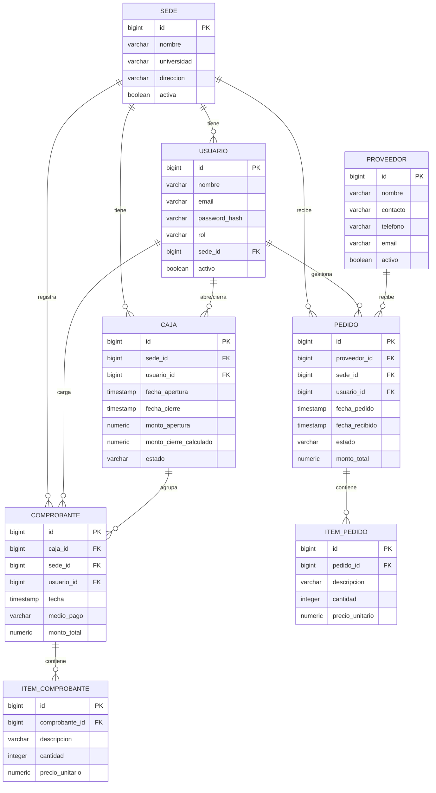

# Diseño de Base de Datos y Módulos — Entrega 2

**Integrantes:** Nazareno Aranda, Julian Blanco Cortes
**Proyecto:** Sistema de gestión de caja y proveedores — cadena de comedores universitarios

---

## 1. Esquema de Base de Datos (Relacional — PostgreSQL)

### Diagrama Entidad-Relación

### Descripción de entidades

| Entidad | Descripción |
|---|---|
| **Sede** | Cada comedor de la cadena. Punto central que agrupa usuarios, cajas, comprobantes y pedidos. |
| **Usuario** | Personas que usan el sistema. Rol: `admin` (visión global, sin sede fija), `cajero` (atado a una sede), `compras` (gestiona pedidos, puede estar atado a una sede o ser central). |
| **Caja** | Representa la apertura/cierre de caja de una sede en un turno o día. Agrupa los comprobantes emitidos en ese período. |
| **Comprobante** | Una venta registrada, asociada a una caja, sede y usuario (cajero). |
| **Item_Comprobante** | Detalle opcional de productos vendidos dentro de un comprobante (para cuando se quiera desglosar la venta, no solo el monto total). |
| **Proveedor** | Proveedores externos de insumos/alimentos. |
| **Pedido** | Un pedido realizado a un proveedor desde una sede. |
| **Item_Pedido** | Detalle de los productos/insumos incluidos en un pedido. |

### Script DDL

Ver archivo [`schema.sql`](./schema.sql) en esta misma carpeta con el script completo listo para ejecutar en PostgreSQL.

---

## 2. Listado de módulos a desarrollar

| # | Módulo | Responsabilidad | Depende de |
|---|---|---|---|
| 1 | **Usuarios y Autenticación** | Login, gestión de roles (admin/cajero/compras), permisos por sede | — |
| 2 | **Sedes** | ABM de comedores/sedes de la cadena | Usuarios |
| 3 | **Caja** | Apertura y cierre de caja por sede, cálculo automático de totales | Sedes, Usuarios |
| 4 | **Ventas / Comprobantes** | Alta y listado de comprobantes de venta, asociados a una caja abierta | Caja |
| 5 | **Proveedores** | ABM de proveedores | — |
| 6 | **Pedidos** | Alta y seguimiento de pedidos a proveedores (pendiente/recibido) por sede | Proveedores, Sedes, Usuarios |
| 7 | **Panel Consolidado (Dashboard)** | Vista para la administración con totales de ventas y pedidos de todas las sedes | Ventas, Pedidos |

Cada módulo se implementa como una app independiente de Django (`usuarios`, `sedes`, `caja`, `ventas`, `proveedores`, `pedidos`, `dashboard`), siguiendo el mismo patrón de capas (modelos → serializers → views/viewsets → urls) usado en la cursada.

### Orden de desarrollo sugerido
1. Usuarios y Autenticación (base de todo lo demás)
2. Sedes
3. Proveedores (independiente, se puede hacer en paralelo)
4. Caja
5. Ventas / Comprobantes
6. Pedidos
7. Panel Consolidado (una vez que hay datos reales de Ventas y Pedidos para agregar)
