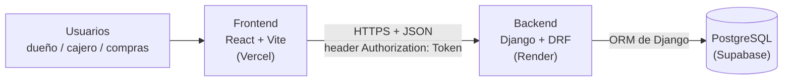
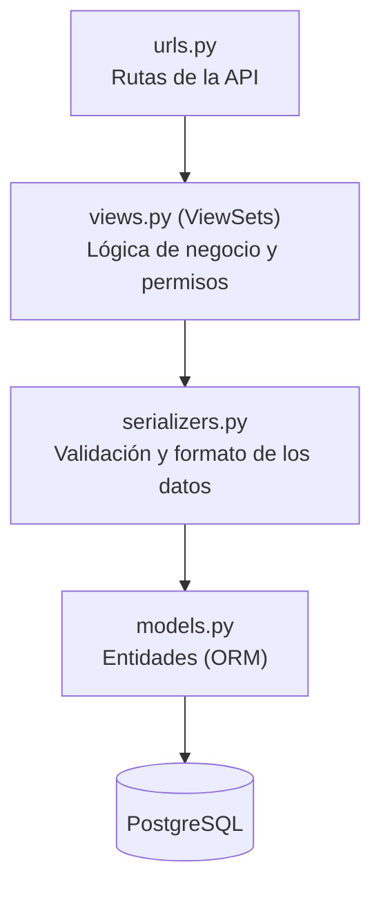

# Arquitectura del Proyecto

**Integrantes:** Nazareno Aranda, Julian Blanco Cortes
**Proyecto:** Sistema de gestión de caja y proveedores — cadena de comedores universitarios

---

## 1. Visión general

El sistema sigue una arquitectura **cliente-servidor** con una **API REST** en el medio: una aplicación web (frontend) que consume una API (backend), la cual es la única que accede a la base de datos.



| Componente | Responsabilidad |
|---|---|
| **Frontend** | Interfaz que usan el cajero, el encargado de compras y la administración. No contiene reglas de negocio ni accede a la base de datos. |
| **Backend** | Expone la API, valida los datos, aplica las reglas de negocio (por ejemplo, calcular el cierre de caja) y controla el acceso. |
| **Base de datos** | Guarda la información de forma persistente y garantiza la integridad de las relaciones. |

## 2. Estilo arquitectónico elegido

**Monolito modular con arquitectura en capas.**

- **Monolito:** el backend es una única aplicación Django, no varios servicios. Para un sistema que usarán pocas personas por sede, una arquitectura de microservicios sería sobreingeniería: más complejidad de despliegue y mantenimiento sin un beneficio real.
- **Modular:** el backend se divide en 7 apps independientes de Django, una por módulo funcional (ver [`02-Diseno-BD-Modulos.md`](./02-Diseno-BD-Modulos.md)).
- **En capas:** dentro de cada módulo el código se separa por responsabilidad (sección 3).
- **Relación con MVC:** Django sigue el patrón MTV (Model–Template–View), variante de MVC. Como la interfaz se construye aparte en React, el rol de la "vista" para el usuario lo cumple el frontend, que consume los datos en formato JSON.

## 3. Capas del backend

Cada módulo (app de Django) organiza su código en las mismas capas:



| Capa | Archivo | Responsabilidad |
|---|---|---|
| Enrutamiento | `urls.py` | Asocia cada dirección de la API con la vista que la atiende. |
| Lógica y control de acceso | `views.py` | Recibe la petición, verifica que el usuario esté autenticado y tenga permiso, y ejecuta la lógica (por ejemplo, el cálculo del cierre de caja). |
| Validación y transformación | `serializers.py` | Valida los datos que llegan y los convierte entre JSON y objetos. |
| Datos | `models.py` | Define las entidades y sus relaciones (se corresponde con el esquema de [`../database/schema.sql`](../database/schema.sql)). |

**Recorrido de una petición** (ejemplo: el cajero registra una venta):

1. El frontend envía un `POST` a la API con el comprobante en JSON y el token en el header `Authorization`.
2. `urls.py` dirige la petición a la vista de comprobantes.
3. La vista verifica el token y que la caja esté abierta.
4. El serializer valida los datos (monto, medio de pago, etc.).
5. El modelo guarda el comprobante en PostgreSQL.
6. La API responde con el comprobante creado, también en JSON.

## 4. Organización modular

| App de Django | Módulo |
|---|---|
| `usuarios` | Usuarios y Autenticación |
| `sedes` | Sedes |
| `proveedores` | Proveedores |
| `caja` | Caja |
| `ventas` | Ventas / Comprobantes |
| `pedidos` | Pedidos |
| `dashboard` | Panel Consolidado |

- **Alta cohesión:** cada app contiene solo lo que corresponde a su responsabilidad (por ejemplo, `proveedores` no tiene lógica de caja).
- **Bajo acoplamiento:** las apps se relacionan entre sí únicamente por claves foráneas (ids), sin depender de la lógica interna de las otras.

## 5. Tecnologías definitivas

| Capa | Tecnología |
|---|---|
| Lenguaje backend | Python |
| Framework backend | Django + Django REST Framework |
| Autenticación | Token Authentication de DRF |
| Base de datos | PostgreSQL |
| Lenguaje y librería frontend | JavaScript + React (con Vite) |
| Hosting backend | Render |
| Hosting base de datos | Supabase (PostgreSQL gestionado) |
| Hosting frontend | Vercel |
| Control de versiones | Git + GitHub (repositorio único) |

Las versiones exactas se fijarán en los archivos de dependencias (`requirements.txt` y `package.json`) al iniciar el desarrollo.

## 6. Justificación de las decisiones técnicas

| Decisión | Alternativa descartada | Motivo |
|---|---|---|
| Monolito modular | Microservicios | Sobreingeniería para el alcance del proyecto: pocos usuarios, un equipo de dos personas y plazo acotado. |
| Python + Django | Node/Express, Java/Spring Boot | El equipo ya conoce Python. Django incluye ORM, autenticación y un panel de administración que reducen mucho el trabajo del MVP. |
| API REST con DRF | Vistas de Django que generen HTML | Permite separar el frontend del backend y desplegarlos por separado, y que el frontend sea una interfaz ágil para cargar comprobantes. |
| PostgreSQL (relacional) | MongoDB (NoSQL) | Los datos tienen estructura fija y relaciones claras entre entidades, y se necesita integridad entre ellas. No hay grandes volúmenes ni estructuras cambiantes que justifiquen NoSQL. |
| Token Authentication | JWT, sesiones de Django | Frontend y backend están en dominios distintos, lo que complica las sesiones con cookies. JWT agrega complejidad (refresh tokens, expiración) sin aportar valor a este alcance. |
| React + Vite | Templates de Django | Interfaz más ágil para el uso diario del cajero y despliegue independiente del frontend. |
| Supabase para la base de datos | Base de datos gratuita de Render | La base gratuita de Render expira a los 30 días de creada, menos que la duración del proyecto. |

## 7. Estructura del repositorio

```
/backend      Aplicación Django + DRF (una app por módulo)
/frontend     Aplicación React + Vite
/database     Scripts DDL/DML y esquemas
/docs         Propuesta, diseño de BD, módulos y arquitectura
README.md     Descripción general, tecnologías, integrantes y estado
```

Por ahora `/backend` y `/frontend` contienen solo su archivo `README.md`: la estructura interna se genera al iniciar el desarrollo, una vez aprobada esta etapa de diseño.

## 8. Conceptos de diseño aplicados

| Concepto | Dónde se aplica |
|---|---|
| Arquitectura en capas | Separación en urls / views / serializers / models dentro de cada módulo (sección 3). |
| Modularización | Una app de Django por módulo funcional (sección 4). |
| Alta cohesión | Cada app agrupa solo lo relacionado con su responsabilidad. |
| Bajo acoplamiento | Las apps se conectan solo por claves foráneas, no por lógica interna. |
| Separación de responsabilidades | Cada capa hace una sola cosa: los modelos no validan entrada, los serializers no controlan permisos. |
| Única responsabilidad | Cada tabla, módulo y capa tiene una única razón para cambiar. |
| Entidad-relación y normalización | Diagrama y decisiones en [`02-Diseno-BD-Modulos.md`](./02-Diseno-BD-Modulos.md). |
| Clean Architecture | No se aplica en su forma estricta: los modelos de Django están acoplados al ORM. Se toma su idea central (separar responsabilidades y organizar por dominio). |
